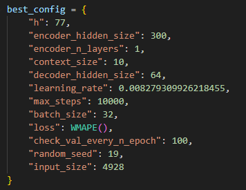
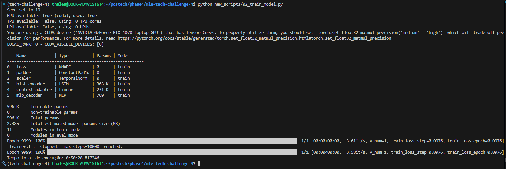

# FIAP - Tech Challenge - Machine Learning Engineering - Fase 4

## Grupo _adicionar número do grupo_

<details open>

<summary> Expandir/Ocultar... </summary>

| **Nome**       |  **RM**  |
| :------------- | :------: |
| Alecrim        |          |
| Diogo Padilha  |          |
| Felipe Bizzo   |          |
| Gabriel Rony   |          |
| Thales Gomes   | _123456_ |

</details>

## Setup

<details open>

<summary> Expandir/Ocultar... </summary>

Esse projeto utiliza o [UV](https://docs.astral.sh/uv/) para gerenciamento do projeto.  
Para instalar siga a documentação em: https://docs.astral.sh/uv/getting-started/  

</details>

## Roadmap

<details open>

<summary> Expandir/Ocultar... </summary>

As tarefas que devem ser executadas estão definidas em: https://github.com/felipbizz/mle-tech-challenge-4/issues/1

</details>

## Premissas do projeto

<details open>

<summary> Expandir/Ocultar... </summary>

Para limitar o escopo de treinamento do modelo restringimos as ações availiadas às seguintes empresas:

```
Atualizar a tabela abaixo com os símbolos reamente em uso:  
['DIS', 'VALE3', 'PETR4', 'ITUB4', 'ABEV3', 'BBDC4', 'SANB11', 'BBAS3', 'JBSS3', 'KLBN11', 'BPAC11', 'BBDC3', 'ITSA4', 'WEGE3']
```

| Cód.  | Empresa   |
| ----- | --------- |
| AAPL  | Apple     |
| MSFT  | Microsoft |
| GOOGL | Google    |
| AMZN  | Amazon    |
| TSLA  | Tesla     |
| DIS   | Disney    |

Para o monitoramento online da API foi utilizada a integração do FastAPI com o Pydantic Logfire.  
Vale ressaltar que para utilizar o Pydantic Logfire é necessário realizar o registro no portal (sendo possível utilizar as credenciais do GitHub como Single Sign On).  
Uma vez registrado, siga as instruções do [link] para configurar o projeto e criar as credenciais necessárias para o envio de métricas.  
Configure o token como uma variável de ambiente a ser utilizada pelo Docker Compose durante a criação do ambiente.  

> Referências (acessadas em 29/01/2025):  
> [Criando um projeto no Pydantic Logfire](https://logfire.pydantic.dev/docs/)  
> [Criando tokens de acesso ao projeto do Pydantic Logfire](https://logfire.pydantic.dev/docs/how-to-guides/create-write-tokens/)  
> [Integrando o FastAPI com o Pydantic Logfire](https://logfire.pydantic.dev/docs/integrations/web-frameworks/fastapi/)  

### Definição do modelo
## Buscando os melhores hiperparâmetros utilizando o AutoLSTM

## Treinando o modelo

Após o tuning do modelo foram observados os hiperparâmetros abaixo que melhor atendiam às previsões.



Estes hiperparâmetros foram então usados no treinamento do modelo, utilizando como entradas os dados armazenados no datalake previamente baixado utilizando a biblioteca YFinance.




</details>

## Imagens docker do projeto

<details open>

<summary> Expandir/Ocultar... </summary>

| Imagem Docker | Descrição |
| :---: | :--- |
| mle-api | API para execução das tarefas |
| prometheus | Servidor Prometheus |
| grafana | Servidor Grafana ||

### Gerando as imagens

#### API

Garanta que o logfire está autenticado e que o arquivo de credencial exista no caminho <APP>/.logfire/logfire_credentials.json  

```bash
docker build -f Dockerfile -t mle-api --secret id=logfire,src=.logfire/logfire_credentials.json .
```

</details>

## Executando o projeto

<details open>

<summary> Expandir/Ocultar... </summary>

Para iniciar todos os containers necessários para a execução do projeto, basta executar o comando a seguir:  
_Lembre-se que é necessário que todas as imagens tenham sido criadas_

```
docker-compose up -d
```

</details>

## Visualizando métricas

<details open>

<summary> Expandir/Ocultar... </summary>

### Visualize as métricas da API online através do portal Logfire

Acesse a URL : https://logfire.pydantic.dev/thalexbr/fiap-mle-fase4

### Obtendo métricas coletadas diretamente do cliente do Prometheus

Acesse a URL : http://localhost:5000/api/v1/query

ou, execute o comando abaixo em um terminal:

```
curl http://localhost:5000/api/v1/query
```

### Acessando a interface do servidor Prometheus

Acesse a URL: http://localhost:9090/query

### Acessando a interface do servidor Grafana

Acesse a URL : http://localhost:3000

> Para detalhes de como acessar o dashboard criado para o projeto, acesse [aqui](./readme_files/GRAFANA.md)

### Monitore a fila de requisições do RabbitMQ

Acesse a URL : http://localhost:15672/#/

> Para detalhes de como navegar na página do RabbitMQ [clique aqui](readme_files/RABBITMQ.md)

</details>

## Estrutura do projeto <<< Atualizar ao Final da Implementação >>>

<details open>

<summary> Expandir/Ocultar... </summary>

```
.
├── README.md
├── config
│   ├── config.py
│   └── settings.toml
├── ml_models
│   ├── neuralforecast_lstm_v4_1_000_epochs.joblib
│   └── neuralforecast_lstm_v6_10_000_epochs.joblib
├── notebooks
│   ├── 00_exploratoria.ipynb
│   └── 01_salva_minio.ipynb
├── project_structure.txt
├── pyproject.toml
├── scripts
│   ├── 00_download_files.py
│   ├── 01_tune_model.py
│   ├── 02_train_model.py
│   ├── __init__.py
│   └── src
│       ├── __init__.py
│       └── utils.py
├── src
│   ├── __init__.py
│   └── utils.py
├── tc4-api
│   ├── Dockerfile
│   ├── README.md
│   ├── api
│   │   ├── __init__.py
│   │   ├── app.py
│   │   └── controllers
│   │       ├── __init__.py
│   │       ├── metrics_controller.py
│   │       └── model_controller.py
│   ├── logs
│   │   ├── api
│   │   │   └── api.log
│   │   └── metrics_controller
│   │       └── metrics_controller.log
│   ├── pyproject.toml
│   └── src
│       ├── __init__.py
│       └── utils.py
└── uv.lock
```

</details>