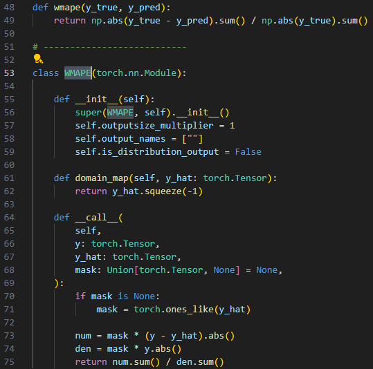
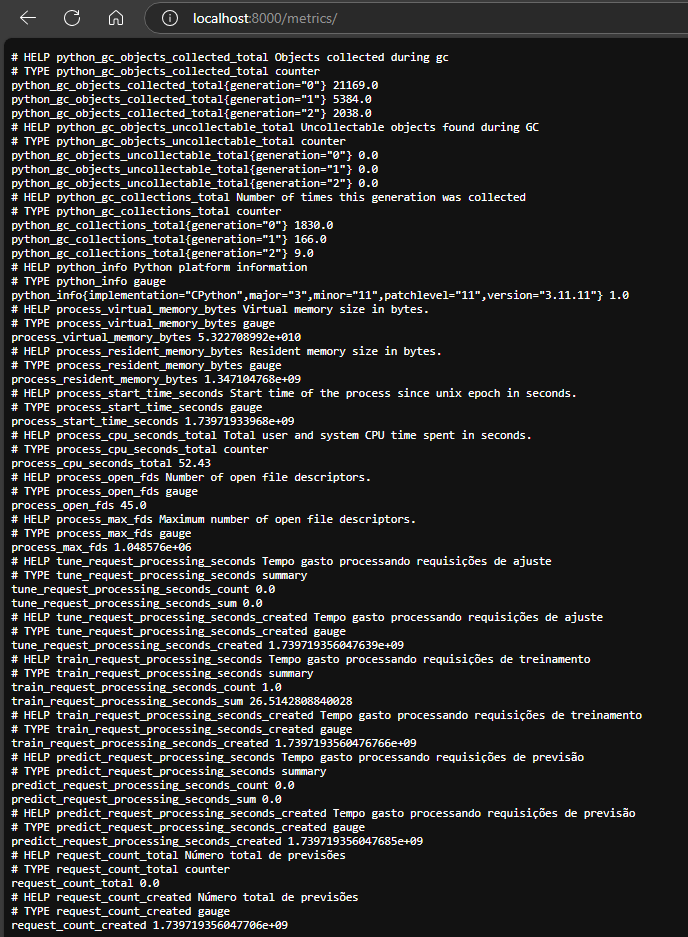
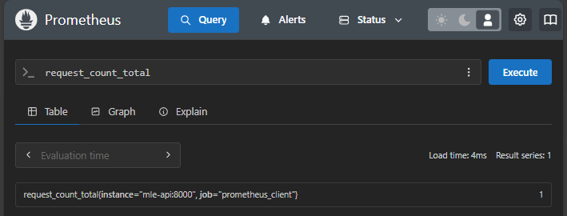
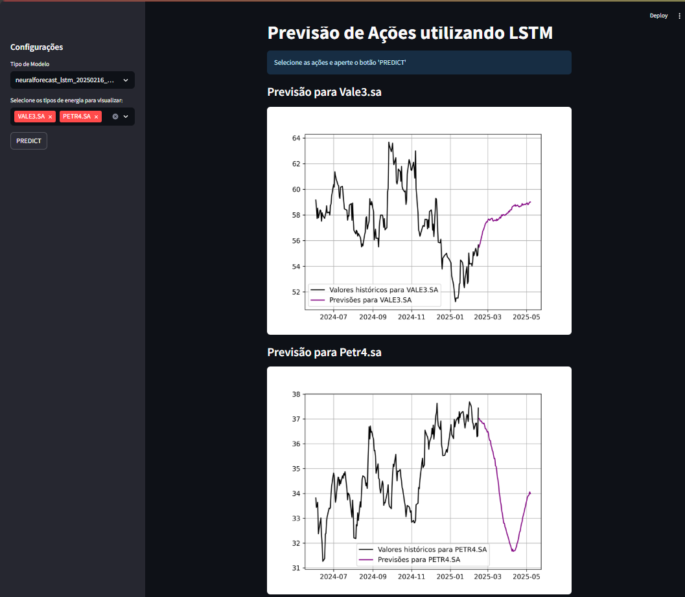

# FIAP - Tech Challenge - Machine Learning Engineering - Fase 4

## Modelo Preditivo de Redes Neurais LSTM para Previsão de Valores de Fechamento da Bolsa de Valores

Este projeto tem como objetivo desenvolver um modelo preditivo utilizando redes neurais Long Short Term Memory (LSTM) para prever o valor de fechamento da bolsa de valores de uma empresa específica. O projeto abrange todas as etapas do desenvolvimento, desde a criação do modelo preditivo até a sua implantação.

## Grupo 9

| **Nome**       | **RM** |
| :------------- | :----: |
| Diogo Padilha  | 357526 |
| Felipe Bizzo   | 356970 |
| Gabriel Rony   | 357376 |
| Lucas Alecrim  | 357415 |
| Thales Gomes   | 357646 |

## Estrutura do Projeto

O projeto está organizado da seguinte forma:

- config/: Contém arquivos de configuração da modelagem.
- deltalake/: Contém os dados brutos e pré-processados da bolsa de valores.
- front/: Contém arquivos de uso do modelo via aplicação web.
- ml_models/: Contém os arquivos de modelo treinados e salvos.
- notebooks/: Contém notebooks Jupyter para exploração de dados, visualização e desenvolvimento do modelo.
- readme_files/: Contém arquivos usados de suporte no README.
- reports/: Contém relatórios gerados e imagens das previsões do modelo.
- scripts/: Contém os scripts Python para coleta de dados, pré-processamento, treinamento e avaliação do modelo.
- src/: Contém arquivos de suporte a modelagem e avaliação de modelos.
- tc4-api/: Contém arquivos de desenvolvimento da API.
- README.md: Este arquivo, contendo informações sobre o projeto e instruções de uso.

## Como Executar o Projeto
Para executar o projeto, siga as seguintes etapas:

1. Clone este repositório: `git clone https://github.com/felipbizz/mle-tech-challenge-4.git`
2. Rode o script: `sh run_project.sh`

Com isso serão criados as dependências e inicializado os containers da aplicação

## Como Usar o Projeto

Para utilizar o projeto, siga estas etapas:

1. Acesse a API através do Swagger UI em: http://localhost:8000/docs

2. Execute as seguintes operações na API:
    - 1. Use o endpoint de download para atualizar dados do Yahoo Finance
    - 2. Liste os modelos disponíveis com o endpoint 'list'
    - 3. Ajuste o modelo usando o endpoint de tuning (opcional)
    - 4. Treine o modelo com o endpoint de treinamento
    - 5. Realize previsões usando o endpoint de predição

3. Visualize os resultados através de:
    - Interface web Streamlit: http://localhost:8501
    - Dashboard Grafana: http://localhost:3000
    - TensorBoard: http://localhost:6006
    - Prometheus: http://localhost:9090

4. Para monitorar o treinamento:
    - Verifique métricas via MlFlow: http://localhost:5000

5. Para monitoramento:
    - Verifique métricas em tempo real via Prometheus
    - Acompanhe logs da aplicação na pasta de logs
    - Monitore o desempenho através do Grafana dashboard
## Premissas do projeto

O escopo de treinamento foi limitado às seguintes empresas listadas na B3:

|Cód.|Empresa|
|---|---|
|VALE3.SA|Vale SA|
|PETR4.SA|Petroleo Brasileiro SA Petrobras PN|
|ITUB4.SA|Itau Unibanco Holding SA PN|
|ABEV3.SA|Ambev SA|
|BBDC4.SA|Banco Bradesco SA PN|
|SANB11.SA|Banco Santander Brasil UNT|
|BBAS3.SA|Banco do Brasil SA|
|JBSS3.SA|JBS SA|
|KLBN11.SA|Klabin SA UNT|
|BPAC11.SA|BTG Pactual UNT|
|BBDC3.SA|Banco Bradesco ON|
|ITSA4.SA|Itausa PN|
|WEGE3.SA|Weg SA|

O monitoramento online da API utiliza integração FastAPI com Pydantic Logfire. Para usar o Pydantic Logfire:
1. Registre-se no portal (possível usar GitHub SSO)
2. Configure o projeto seguindo a documentação oficial
3. Crie as credenciais para métricas
4. Injete as credenciais na imagem Docker da API

> Referências:  
> - [Documentação Pydantic Logfire](https://logfire.pydantic.dev/docs/)
> - [Tokens de acesso](https://logfire.pydantic.dev/docs/how-to-guides/create-write-tokens/)
> - [Integração FastAPI](https://logfire.pydantic.dev/docs/integrations/web-frameworks/fastapi/)

## Definição do modelo

O projeto utiliza o modelo LSTM da biblioteca NeuralForecast (NIXTLA) com função de autoajuste (AutoLSTM) para otimização de hiperparâmetros.

Como métrica de erro, implementamos o WMAPE (Weighted Mean Absolute Percentage Error), uma variação ponderada do MAPE.



### Implantação

1. Configure o Logfire:
    - Garanta que existe o arquivo `.logfire/logfire_credentials.json`
    - Ou execute `sh inicializarLogfireCredentials.sh` na pasta `tc4-api` para criar credenciais vazias

2. Build da imagem API:
```bash
docker build -f Dockerfile -t mle-api --secret id=logfire,src=.logfire/logfire_credentials.json .
```

3. Inicie os containers:
```bash
docker-compose up -d
```

> **Nota**: Os modelos requerem GPU para execução adequada.

Para reconstruir após alterações:
```bash
docker-compose build --no-cache
```

## Acessando a API

Acesse a URL : http://localhost:8000/docs para ter acesso ao SwaggerUI

### Atualizando o DeltaLake com dados do Yahoo! Finance

Ao executar o endpoint de download, os símbolos informados no corpo da requisição serão baixados e inseridos no DeltaLake.  
É importante notar que caso não haja valores para um certo símbolo ele será considerado como um erro de carga.


### Listando modelos treinados disponíveis para previsões

Utilize o endpoint 'list' para obter os modelos disponíveis.  
Dentre os modelos, poderão ser listados tanto modelos gerados durante o ajuste de hiperparâmetros quanto modelos treinados com os parâmetros informados à API de treinamento.  


### Ajustando o modelo em busca dos melhores hiperparâmetros

Este é processo que pode levar bastante tempo e, por isso, é recomendado que só seja realizado quando necessário.  
Ao final da execução serão retornados os melhores hiperparâmetros encontrados durante a fase de ajuste.  
O ajuste abaixo foi executado em 15m23s.


### Treinando o modelo

De posse dos hiperparâmetros encontrados na fase de ajuste, é possível executar o treinamento do modelo que será utilizado para as previsões.  
Este endpoint retorna o nome do arquivo salvo contendo o modelo treinado no formato JOBLIB.


### Realizando previsões

Informe a ação (símbolo) e o modelo a ser usado na previsão.

> Uma lista com os modelos treinados disponíveis para previsão pode ser obtida através de um endpoint da própria API.


Ao final da previsão o endpoint irá gerar uma imagem na pasta _reports_ com o resultado similar à imagem abaixo:


# Visualizando métricas

## Dados do TensorBoard

Durante a fase de ajuste, é possível visualizar os dados do Tensorboard que são expostos pelo container.  
Os arquivos de log a serem utilizados para a visualização do TensorBoard se encontram em: volumes/mle-api/ray/_id-da-sessao_/artifacts/_data-da-sessao_/__train_tune_data-de-execucao_/driver_artifacts

```bash
tensorboard --logdir volumes/mle-api/ray/_id-da-sessao_/artifacts/_data-da-sessao_/__train_tune_data-de-execucao_/driver_artifacts
```


O dashboard será carregado na URL http://localhost:6006/  
Neste dashboard é possível ver o comparativo dos gráficos gerados por cada amostra realizada pelo AutoLSTM.


## Visualize as métricas da API online através do portal Logfire

O acesso ao dashboard do Logfire irá variar de acordo com o usuário e projetos utilizados na ferramenta.  
A URL abaixo é apenas uma referência, uma vez que será solicitada a credencial de acesso para o usuário.  
URL : https://logfire.pydantic.dev/_usuario_/_nome_do_projeto_


## Obtendo métricas coletadas diretamente do cliente do Prometheus

Acesse a URL : http://localhost:8000/metrics/

ou, execute o comando abaixo em um terminal:

```bash
curl http://localhost:8000/metrics/
```



## Acessando a interface do servidor Prometheus

Acesse a URL: http://localhost:9090/query

Através desta interface é possível consultar métricas diretamente do servidor do Prometheus.



## Acessando a interface do servidor Grafana

Acesse a URL : http://localhost:3000

> Acesse o dashboard utilizando as credenciais admin/admin.  
> É possível que seja solicitado que esta credencial seja alterada no primeiro acesso.

### Definição da fonte de dados

O Grafana foi configurado para receber dados coletados pelo servidor Prometheus.  
Detalhes desta configuração estão fora do escopo deste trabalho, mas podem ser encontrados na referência abaixo.  
Neste projeto há um dashboard pré-configurado chamado **FIAP MLE Fase 4**

[Suporte do Grafana à fonte de dados do Prometheus](https://prometheus.io/docs/visualization/grafana/)

### Visualizando o dashboard


### Validando os dados do dashboard de acordo com o que foi registrado no log

Abaixo podemos fazer a correspondência entre o valor registrado no dashboard do Grafana com o valor calculado e registrado nos logs para o tempo consumido em uma requisição de treinamento.


## Acessando os logs da aplicação

Informações relevantes são registradas nos logs correspondentes de cada módulo da aplicação.


Abaixo é exibido um exemplo de como estão estruturados os logs gerados.


# Testando o ambiente produtivo através do frontend

Acesse a URL: http://localhost:8501

Selecione o modelo (pré-treinado) da caixa de seleção.

Escolha quais ações devem executar a previsão e clique em **PREDICT**

Serão exibidos os gráficos com as previsões correspondentes a cada ação selecionada.

