# FIAP - Tech Challenge - Machine Learning Engineering - Fase 4

## Grupo 9

<details open>

<summary> Expandir/Ocultar... </summary>

| **Nome**       | **RM** |
| :------------- | :----: |
| Diogo Padilha  | 357526 |
| Felipe Bizzo   | 356970 |
| Gabriel Rony   | 357376 |
| Lucas Alecrim  | 357415 |
| Thales Gomes   | 357646 |

</details>

## Setup

<details open>

<summary> Expandir/Ocultar... </summary>

Esse projeto utiliza o [UV](https://docs.astral.sh/uv/) para gerenciamento do projeto.  
Para instalar siga a documentação em: https://docs.astral.sh/uv/getting-started/  

</details>

## Roadmap

<details open>

<summary> Expandir/Ocultar... </summary>

As tarefas que devem ser executadas estão definidas em: https://github.com/felipbizz/mle-tech-challenge-4/issues/1

</details>

## Premissas do projeto

<details open>

<summary> Expandir/Ocultar... </summary>

Para limitar o escopo de treinamento do modelo restringimos as ações availiadas às seguintes empresas:

|Cód.|Empresa|
|---|---|
|DIS|Disney|
|VALE3.SA|Vale SA|
|PETR4.SA|Petroleo Brasileiro SA Petrobras Preference Shares|
|ITUB4.SA|Itau Unibanco Holding SA Preference Shares|
|ABEV3.SA|Ambev SA|
|BBDC4.SA|Banco Bradesco SA Preference Shares|
|SANB11.SA|SANTANDER BR UNT|
|BBAS3.SA|Banco do Brasil SA|
|JBSS3.SA|JBS SA|
|KLBN11.SA|KLABIN S/A UNT N2|
|BPAC11.SA|BTG PACTUAL BANCO UNT|
|BBDC3.SA|BRADESCO ON EJ N1|
|ITSA4.SA|ITAUSA PN|
|WEGE3.SA|Weg SA|

Para o monitoramento online da API foi utilizada a integração do FastAPI com o Pydantic Logfire.  
Vale ressaltar que para utilizar o Pydantic Logfire é necessário realizar o registro no portal (sendo possível utilizar as credenciais do GitHub como Single Sign On).  
Uma vez registrado, siga as instruções encontradas nas referências abaixo para configurar o projeto e criar as credenciais necessárias para o envio de métricas.  
Para a correta execução do ambiente do docker compose será necessário injetar as credenciais do Logfire na imagem da API.
Mais informações sobre como realizar a build se encontram em seções abaixo. 

> Referências (acessadas em 29/01/2025):  
> [Criando um projeto no Pydantic Logfire](https://logfire.pydantic.dev/docs/)  
> [Criando tokens de acesso ao projeto do Pydantic Logfire](https://logfire.pydantic.dev/docs/how-to-guides/create-write-tokens/)  
> [Integrando o FastAPI com o Pydantic Logfire](https://logfire.pydantic.dev/docs/integrations/web-frameworks/fastapi/)  

# Definição do modelo
## Buscando os melhores hiperparâmetros utilizando o AutoLSTM

## Treinando o modelo

Após o tuning do modelo foram observados os hiperparâmetros abaixo que melhor atendiam às previsões.

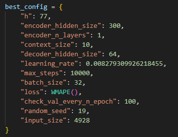

Estes hiperparâmetros foram então usados no treinamento do modelo, utilizando como entradas os dados armazenados no datalake previamente baixado utilizando a biblioteca YFinance.

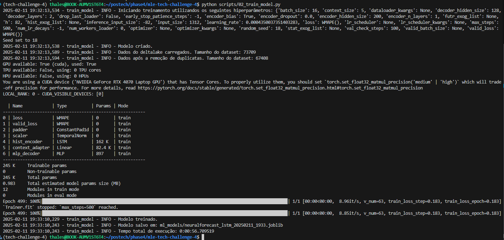


</details>

## Imagens docker do projeto

<details open>

<summary> Expandir/Ocultar... </summary>

| Imagem Docker | Descrição |
| :---: | :--- |
| mle-api | API para execução das tarefas |
| prometheus | Servidor Prometheus |
| grafana | Servidor Grafana |
| mlflow | Servidor MLFlow |

### Gerando a imagem da API

#### API

Garanta que o logfire está autenticado e que o arquivo de credencial exista no caminho <APP>/.logfire/logfire_credentials.json  

```bash
docker build -f Dockerfile -t mle-api --secret id=logfire,src=.logfire/logfire_credentials.json .
```

</details>

<details open>

<summary> Expandir/Ocultar... </summary>

Para iniciar todos os containers necessários para a execução do projeto, basta executar o comando a seguir:  
_Lembre-se que é necessário que todas as imagens tenham sido criadas_


> **Importante**  
> Os modelos foram treinados em um ambiente com GPU e, portanto, podem gerar o erro abaixo caso não sejam executados em um ambiente que não a possua.

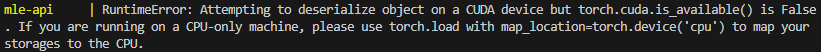

```bash
docker-compose up -d
```

</details>

## Acessando a API

Acesse a URL : http://localhost:8000/docs para ter acesso ao SwaggerUI

### Atualizando o DeltaLake com dados do Yahoo! Finance

<details open>

<summary> Expandir/Ocultar... </summary>  

Ao executar o endpoint de download, os símbolos informados no corpo da requisição serão baixados e inseridos no DeltaLake.  
É importante notar que caso não haja valores para um certo símbolo ele será considerado como um erro de carga.

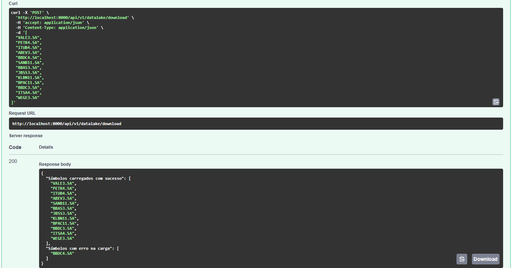

</details>


### Listando modelos treinados disponíveis para previsões

<details open>

<summary> Expandir/Ocultar... </summary>

Utilize o endpoint 'list' para obter os modelos disponíveis.  
Dentre os modelos, poderão ser listados tanto modelos gerados durante o ajuste de hiperparâmetros quanto modelos treinados com os parâmetros informados à API de treinamento.  

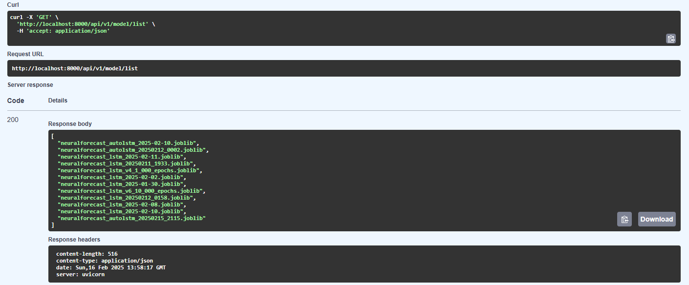

</details>

### Ajustando o modelo em busca dos melhores hiperparâmetros

<details open>

<summary> Expandir/Ocultar... </summary>

Este é processo que pode levar bastante tempo e, por isso, é recomendado que só seja realizado quando necessário.  
Ao final da execução serão retornados os melhores hiperparâmetros encontrados durante a fase de ajuste.
O ajuste abaixo foi executado em 15m23s.

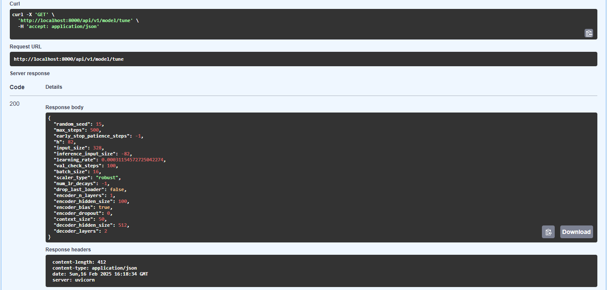

</details>

### Treinando o modelo

<details open>

<summary> Expandir/Ocultar... </summary>

De posse dos hiperparâmetros encontrados na fase de ajuste, é possível executar o treinamento do modelo que será utilizado para as previsões.  
Este endpoint retorna o nome do arquivo salvo contendo o modelo treinado no formato JOBLIB.

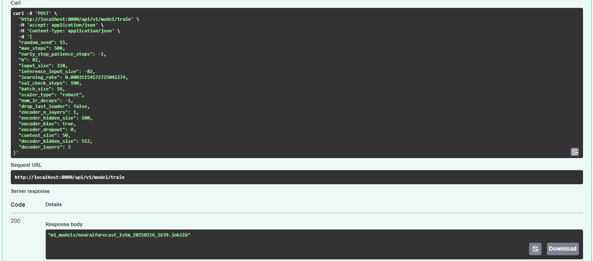

</details>

### Realizando previsões

<details open>

<summary> Expandir/Ocultar... </summary>

Informe a ação (símbolo) e o modelo a ser usado na previsão.

> Uma lista com os modelos treinados disponíveis para previsão pode ser obtida através de um endpoint da própria API.

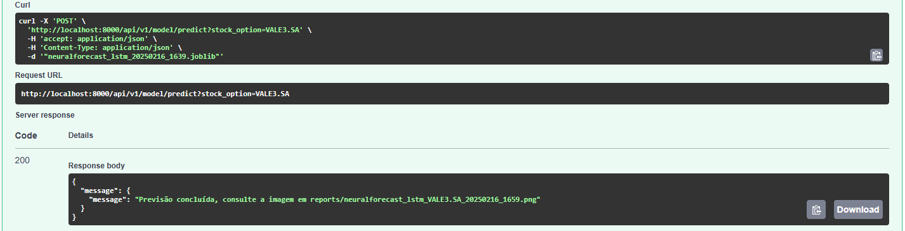

Ao final da previsão o endpoint irá gerar uma imagem na pasta _reports_ com o resultado similar à imagem abaixo:

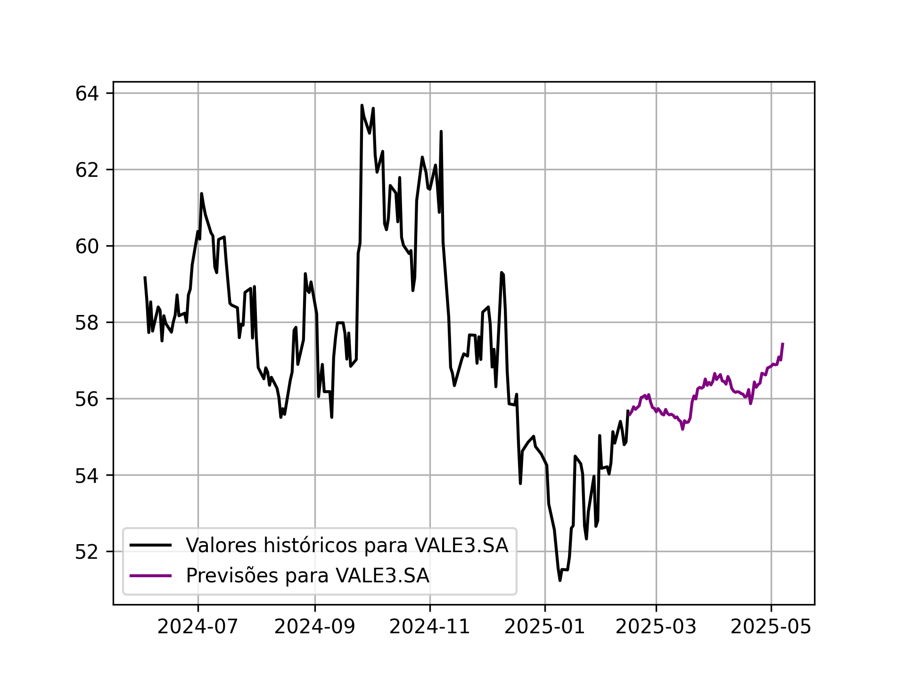

</details>

# Visualizando métricas

<details open>

<summary> Expandir/Ocultar... </summary>

## Dados do TensorBoard

Durante a fase de ajuste, é possível visualizar os dados do Tensorboard que são expostos pelo container.  
Os arquivos de log a serem utilizados para a visualização do TensorBoard se encontram em: volumes/mle-api/ray/_id-da-sessao_/artifacts/_data-da-sessao_/__train_tune_data-de-execucao_/driver_artifacts

```bash
tensorboard --logdir volumes/mle-api/ray/_id-da-sessao_/artifacts/_data-da-sessao_/__train_tune_data-de-execucao_/driver_artifacts
```

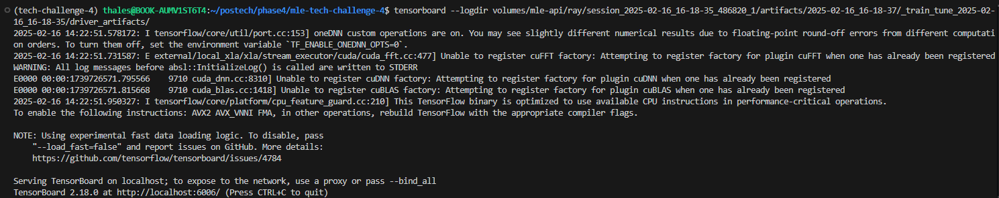

O dashboard será carregado na URL http://localhost:6006/  
Neste dashboard é possível ver o comparativo dos gráficos gerados por cada amostra realizada pelo AutoLSTM.

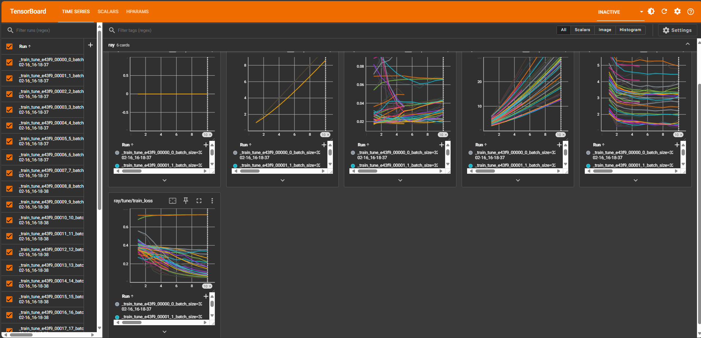

## Visualize as métricas da API online através do portal Logfire

O acesso ao dashboard do Logfire irá variar de acordo com o usuário e projetos utilizados na ferramenta.  
A URL abaixo é apenas uma referência, uma vez que será solicitada a credencial de acesso para o usuário.  
URL : https://logfire.pydantic.dev/_usuario_/_nome_do_projeto_

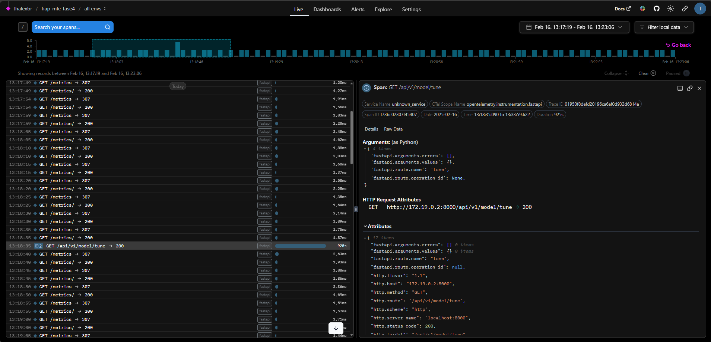

## Obtendo métricas coletadas diretamente do cliente do Prometheus

Acesse a URL : http://localhost:8000/metrics/

ou, execute o comando abaixo em um terminal:

```bash
curl http://localhost:8000/metrics/
```

## Acessando a interface do servidor Prometheus

Acesse a URL: http://localhost:9090/query

## Acessando a interface do servidor Grafana

Acesse a URL : http://localhost:3000

> Acesse o dashboard utilizando as credenciais admin/admin.  
> É possível que seja solicitado que esta credencial seja alterada no primeiro acesso.

### Definição da fonte de dados

O Grafana foi configurado para receber dados coletados pelo servidor Prometheus.  
Detalhes desta configuração estão fora do escopo deste trabalho, mas podem ser encontrados na referência abaixo.

[Suporte do Grafana à fonte de dados do Prometheus](https://prometheus.io/docs/visualization/grafana/)


### Visualizando o dashboard

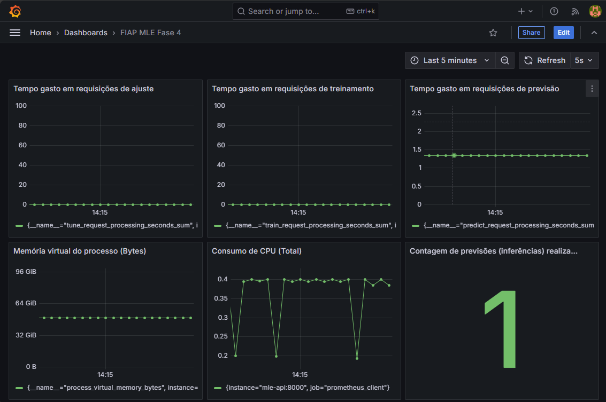


#### Verificando dados do dashboard de acordo com o que foi registrado no log

Abaixo podemos fazer a correspondência entre o valor registrado no dashboard do grafana com o valor calculado e registrado nos logs para o tempo consumido em uma requisição de treinamento.

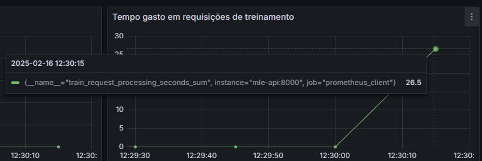

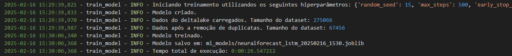

## Acessando os logs da aplicação

Informações relevantes são registradas nos logs correspondentes de cada módulo da aplicação.

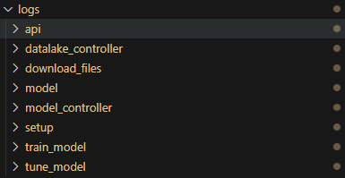

Abaixo é exibido um exemplo de como estão estruturados os logs gerados.

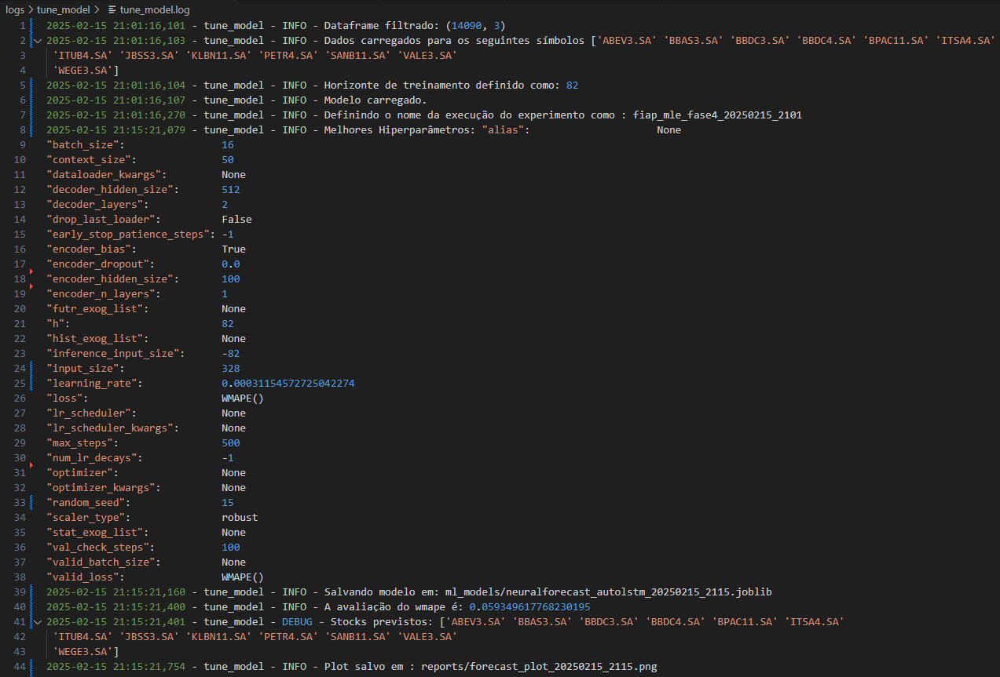

## Estrutura do projeto <<< Atualizar ao Final da Implementação >>>

<details open>

<summary> Expandir/Ocultar... </summary>

```
.
├── README.md
├── config
│   ├── config.py
│   └── settings.toml
├── ml_models
│   ├── neuralforecast_lstm_v4_1_000_epochs.joblib
│   └── neuralforecast_lstm_v6_10_000_epochs.joblib
├── notebooks
│   ├── 00_exploratoria.ipynb
│   └── 01_salva_minio.ipynb
├── project_structure.txt
├── pyproject.toml
├── scripts
│   ├── 00_download_files.py
│   ├── 01_tune_model.py
│   ├── 02_train_model.py
│   ├── __init__.py
│   └── src
│       ├── __init__.py
│       └── utils.py
├── src
│   ├── __init__.py
│   └── utils.py
├── tc4-api
│   ├── Dockerfile
│   ├── README.md
│   ├── api
│   │   ├── __init__.py
│   │   ├── app.py
│   │   └── controllers
│   │       ├── __init__.py
│   │       ├── metrics_controller.py
│   │       └── model_controller.py
│   ├── logs
│   │   ├── api
│   │   │   └── api.log
│   │   └── metrics_controller
│   │       └── metrics_controller.log
│   ├── pyproject.toml
│   └── src
│       ├── __init__.py
│       └── utils.py
└── uv.lock
```

</details>